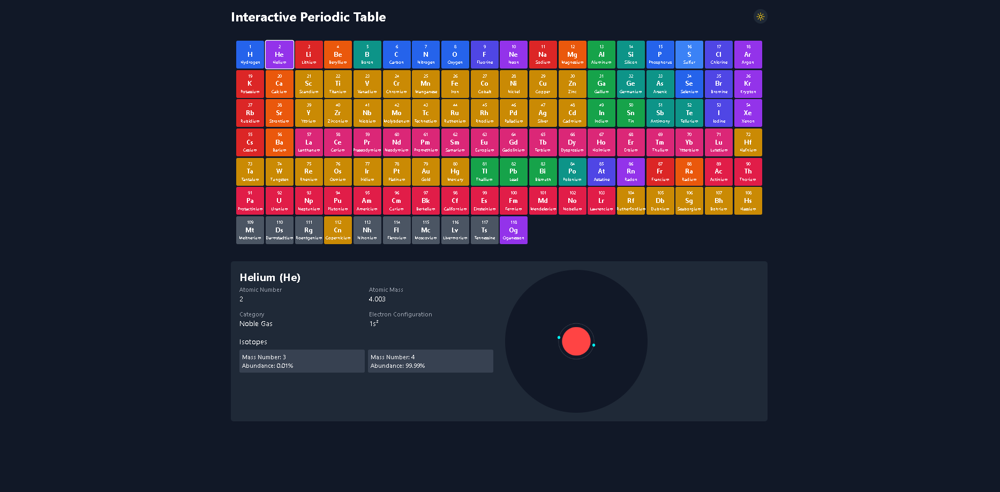
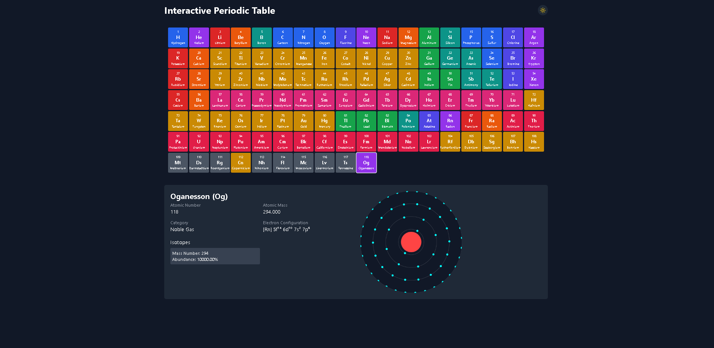

# Interactive Atomic Structure Visualization


## Overview

Welcome to **Interactive Atomic Structure Visualization**, where atomic science meets stunning interactivity! This project allows users to explore atomic structures, visualize electron configurations, and analyze element properties in an engaging and interactive manner.

## Features

* **3D Atomic Visualization** – Interact with dynamic 3D atomic models.
* **Electron Configuration Viewer** – Observe electron distribution across orbitals.
* **Element Information Hub** – Instantly access atomic number, mass, symbol, category, and isotopic data.
* **User Interactivity** – Click on elements to dynamically reveal unique structures.
* **Modern UI & Smooth Animations** – Enjoy a sleek, responsive interface with fluid animations.
* **Dark Mode Support** – Switch between light and dark themes effortlessly.

## Demo

Helium


Oganesson


## Technologies Used

* **TypeScript** – Ensuring structured and scalable development.
* **React.js** – Powering interactive UI components.
* **Three.js** – Enabling 3D visualization of atomic structures.
* **Tailwind CSS** – Providing a modern and responsive design.
* **Data Source** – Atomic element details stored in `elements.ts`.

## Installation Guide

1. **Clone the Repository**

   ```sh
   git clone https://github.com/RohanCyberOps/Interactive-Atomic-Structure-Visualization.git
   cd Interactive-Atomic-Structure-Visualization
   ```
2. **Install Dependencies**

   ```sh
   npm install
   ```
3. **Start the Development Server**

   ```sh
   npm start
   ```
4. Open [http://localhost:3000](http://localhost:3000) in your browser and dive into the atomic world!

## How to Use

* **Select an element** from the interactive periodic table.
* **Explore its 3D atomic structure** and electron configurations.
* **Hover over shells** to unveil detailed electron distributions.
* **Click on isotopes** to analyze their abundance and properties.
* **Switch between visualization modes** for enhanced analysis.

## Contributing

We welcome contributions! Here’s how you can help:

1. **Fork the Repository**
2. **Create a Feature Branch** (`git checkout -b feature-name`)
3. **Commit Your Changes** (`git commit -m "Added awesome feature"`)
4. **Push to GitHub** (`git push origin feature-name`)
5. **Open a Pull Request**

## License

This project is open-source and licensed under the **MIT License**. Feel free to use, enhance, and share it!

## Contact & Support

Got questions or ideas? Let's connect!

* **GitHub**: [@RohanCyberOps](https://github.com/RohanCyberOps)
* **Email**: [rohan150907@gmail.com](mailto:rohan150907@gmail.com)

**Unlock the wonders of atomic structures—explore now!**

---
